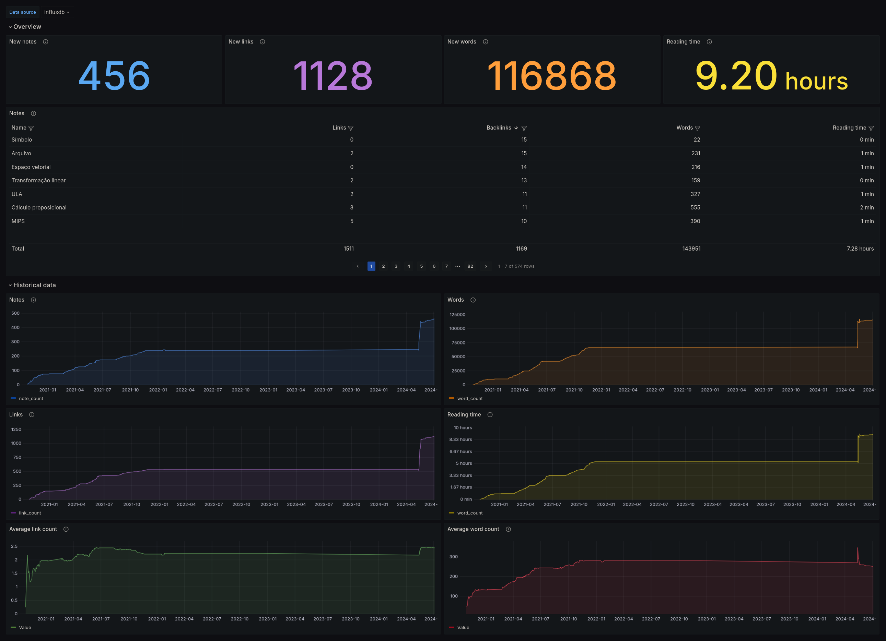

# Zettelkasten exporter

> [!WARNING]
> This is still a work in progress, expect breaking changes

An agent that collects metrics from an zettelkasten and stores them into an InfluxDB bucket.

## Features

- Collect metrics from a local directory or a git repository
- Backfill historical metrics
- Parses both markdown and wiki links
- Authenticate in private git repositories using personal access tokens
- Grafana dashboards included

## Usage

The exporter is distributed as both a binary and a Docker image. The currently documented ways of deploy are via docker compose and Kubernetes. For details about the setup, check out the examples:

- [Docker compose example](./examples/compose).
- [Kubernetes example](./examples/kubernetes).

Note that for a complete solution, it will be necessary to also configure InfluxDB and Grafana. For more information about setting them up, refer to their documentation. Here are some links that might be useful:

- https://grafana.com/docs/grafana/latest/getting-started/get-started-grafana-influxdb/
- https://docs.influxdata.com/influxdb/v2/get-started/setup/

## Configuration

All configuration is supplied via environment variables. You should supply at least the required variables and either the `ZETTELKASTEN_DIRECTORY` or the `ZETTELKASTEN_GIT_URL` variables.

| Name                       | Description                                                          | Default                        | Required |
| -------------------------- | -------------------------------------------------------------------- | ------------------------------ | -------- |
| INFLUXDB_URL               | The InfluxDB URL                                                     |                                | Yes      |
| INFLUXDB_TOKEN             | The InfluxDB token to authenticate in the bucket                     |                                | Yes      |
| INFLUXDB_ORG               | The InfluxDB org containing the bucket                               |                                | Yes      |
| INFLUXDB_BUCKET            | The InfluxDB bucket to register metrics                              |                                | Yes      |
| ZETTELKASTEN_DIRECTORY     | The local directory containing the zettelkasten                      |                                | No       |
| ZETTELKASTEN_GIT_URL       | The URL for the git repository containing the zettelkasten           |                                | No       |
| ZETTELKASTEN_GIT_TOKEN     | The access token to authenticate with private repositories           |                                | No       |
| ZETTELKASTEN_GIT_BRANCH    | The branch to use for git repositories                               | main                           | No       |
| COLLECTION_INTERVAL        | Time to wait between metric collections                              | 5m                             | No       |
| COLLECT_HISTORICAL_METRICS | Wether to collect historical metrics at startup                      | true                           | No       |
| IGNORE_FILES               | Comma separated list of files that will be ignored in the collection | .git,obsidian,.trash,README.md | No       |
| LOG_LEVEL                  | The minimum log level                                                | INFO                           | No       |

## References

https://prometheus.io/docs/instrumenting/writing_exporters/

https://github.com/go-git/go-git/blob/master/_examples/pull/main.go

https://medium.com/tlvince/prometheus-backfilling-a92573eb712c

https://github.com/influxdata/helm-charts/tree/master/charts/influxdb2

https://grafana.com/docs/grafana/latest/getting-started/get-started-grafana-influxdb/

https://docs.influxdata.com/flux/v0/get-started/

https://github.com/onedr0p/exportar
