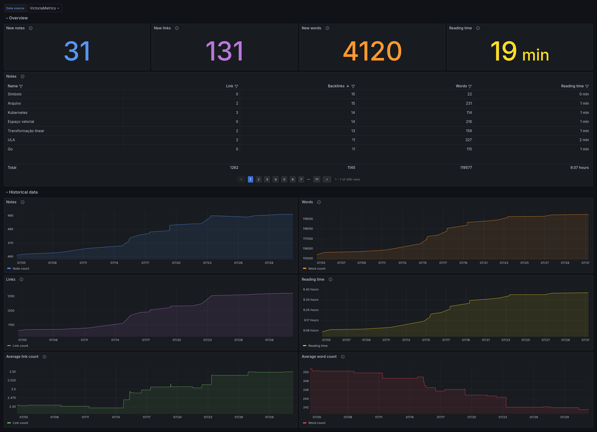

[](https://github.com/luissimas/zettelkasten-exporter/actions/workflows/check.yaml)
[](https://goreportcard.com/report/github.com/luissimas/zettelkasten-exporter)
[](https://codecov.io/gh/luissimas/zettelkasten-exporter)

# Zettelkasten exporter

Essa aplicação consiste em um agente que coleta métricas de um repositório de anotações em markdown no estilo [Zettelkasten](https://en.wikipedia.org/wiki/Zettelkasten) e as escreve em uma [base de dados temporal](https://en.wikipedia.org/wiki/Time_series_database) para que as métricas possam ser consultadas por ferramentas como o [Grafana](https://grafana.com/).

Esse é o repositório oficial da aplicação, e contém todo o código fonte, Dockerfile e exemplos de deployment usando docker-compose e Kubernetes. A branch `devops-t1` foi modificada para atender aos requisitos de entrega do trabalho. Para uma descrição completa da aplicação, suas funcionalidades e opções de configuração, acesse a branch `main`.



Como solicitado na descrição da atividade, esse README também está disponível em formato PDF no arquivo [README.pdf](./README.pdf).

## Visão geral da aplicação

A aplicação coleta métricas de um zettelkasten local ou em um repositório git remoto e as escreve em uma base de dados temporal (InfluxDB ou VictoriaMetrics). O Grafana utiliza a base de dados temporal para criar visualizações gráficas das métricas para o usuário final.


A única porta exposta para o usuário no conjunto de aplicações é a porta 3000 do serviço do Grafana.

## Usando a aplicação

Para utilizar a aplicação para o propósito desse trabalho, é necessário clonar esse repositório e entrar na branch `devops-t1`. É importante destacar que os artefatos relacionados a esse trabalho estarão presentes somente na branch `devops-t1`, e não na branch `main`.

```shell
git clone https://github.com/luissimas/zettelkasten-exporter.git
cd zettelkasten-exporter
git switch devops-t1
```

Para buildar a imagem da aplicação localmente, podemos usar o seguinte comando na raiz do repositório:

```shell
docker build . -t zettelkasten-exporter:latest
```

Não é necessário nem recomendado buildar a imagem localmente, visto que as imagens oficiais do projeto são buildadas através de um processo de CI e publicadas no meu [GitHub registry](https://github.com/luissimas/zettelkasten-exporter/pkgs/container/zettelkasten-exporter). Sendo assim, o arquivo docker compose presente nesse repositório utiliza a imagem desse registry, e não uma imagem local.

Para executar as aplicações via docker compose, basta executar o seguinte comando na raiz do repositório:

```shell
docker compose up
```

Após aguardar alguns segundos até que o Grafana finalize a execução das suas migrações de banco de dados, ele pode ser acessado em <http://localhost:3000>. O usuário padrão é `admin`, com a senha inicial também `admin`.

Após fazer login no Grafana, navegue até a página "Dashboards" no menu superior esquerdo. Ao acessar essa página, ela deve conter um único dashboard chamado "Zettelkasten" clique nesse dashboard.

Ao abrir o dashboard, você será apresentado à métricas coletadas a partir das anotações de exemplo feitas no diretório [sample-zettelkasten](./sample-zettelkasten/). Modifique as anotações nesse diretório adicionando novas palavras, links ou arquivos markdown e veja as métricas sendo atualizadas no dashboard após alguns segundos.
